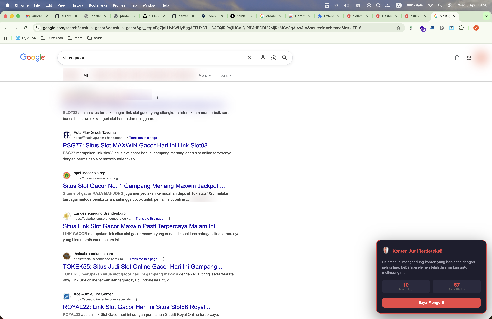
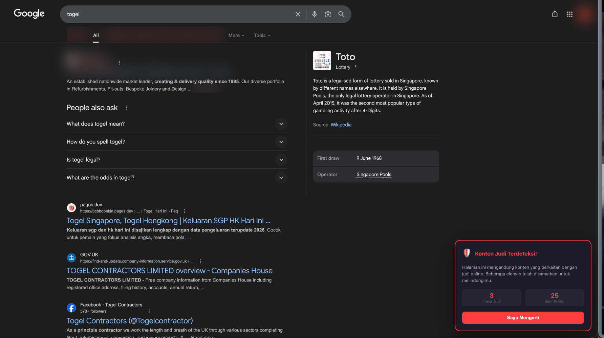
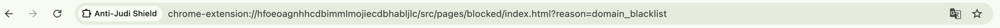
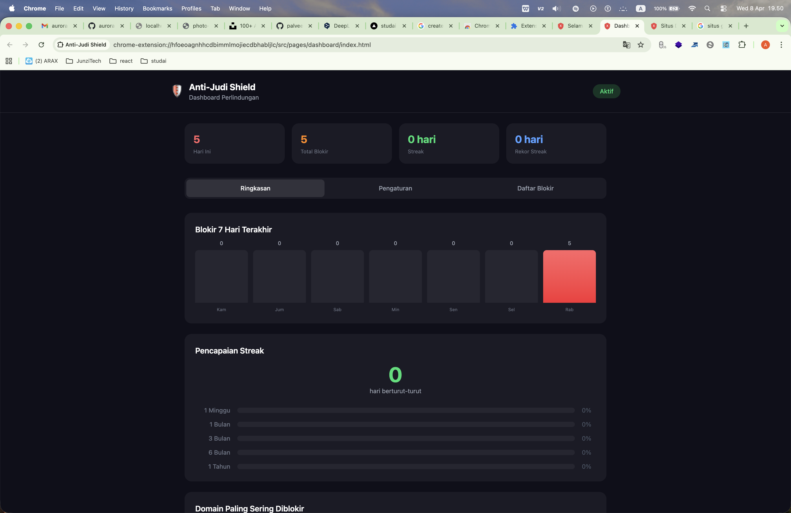

# Anti-Judi Shield

A Chrome Extension that protects users from online gambling sites — blocking, educating, and supporting recovery. Built for the Indonesian market but effective against international gambling platforms worldwide.

---

## Features

### Smart Website Blocking
- **Static domain blacklist** — 150+ known Indonesian and international gambling domains
- **Pattern matching** — Regex-based detection of suspicious domain patterns (e.g., `*slot*.xyz`, `*judi*.site`)
- **URL keyword detection** — Blocks URLs containing gambling terms like "slot-gacor", "bocoran-slot", "maxwin"
- **International sites** — Blocks 1xbet, bet365, betway, 888casino, PokerStars, DraftKings, Stake, Roobet, and 80+ more
- **Interception page** — Redirects to an educational block page with countdown timer

### AI Content Detection
Detects gambling content on **any page** — including legitimate domains hijacked by gambling operators (universities, government sites, restaurants).

Five-layer structural analysis:
| Analyzer | What it detects |
|---|---|
| **Meta** | Gambling keywords in `<title>`, meta description, canonical URLs, OG tags |
| **Links** | Gambling link farms, WhatsApp/Telegram contacts, footer link density |
| **DOM** | Heading tag abuse, hidden cloaking elements, gambling iframes, deposit forms |
| **Text** | Keyword density, phrase repetition, jargon clustering |
| **Coherence** | Domain hijacking — `.edu`, `.gov`, `.org` domains serving gambling content |

Confidence levels (`low` / `medium` / `high`) prevent false positives. High-confidence detections are auto-blacklisted.

### Ad & Image Blocking
- Removes gambling banner ads, pop-ups, and redirects
- Blocks gambling images and media at both network level (DNR) and DOM level
- YouTube gambling ad detection
- Background image blocking

### Anti-Bypass System
- **Strict Mode** — Requires a PBKDF2-hashed password to disable protection
- **Accountability Partner** — Notifies a chosen contact when disabling is attempted
- **Anti-uninstall** — Detects and counters extension disable attempts

### Behavioral Dashboard
- Daily and weekly block statistics
- Streak tracking with milestones (7, 30, 90, 180, 365 days)
- Top blocked domains list
- Custom blacklist and whitelist management

### Educational Block Page
- 5–30 second countdown timer before any action
- Random motivational quotes (Indonesian & English)
- Gambling risk facts with sources
- Personal goals reminder

---

## Tech Stack

| | |
|---|---|
| **Build** | Vite + `@crxjs/vite-plugin` |
| **Language** | TypeScript (strict) |
| **UI** | React 19 + Tailwind CSS v4 |
| **Extension** | Chrome Manifest V3 |
| **Linter** | Biome |
| **Tests** | Vitest |
| **Package manager** | pnpm |

---

## Project Structure

```
src/
├── background/
│   ├── service-worker.ts    # MV3 service worker entry
│   ├── blocker.ts           # DeclarativeNetRequest engine
│   ├── analytics.ts         # Block tracking + auto-blacklist
│   ├── accountability.ts    # Partner notifications
│   └── rule-updater.ts      # Dynamic rule refresh
│
├── content/
│   ├── index.ts             # Content script entry
│   ├── scoring.ts           # AI detection orchestrator
│   ├── scanner.ts           # Keyword scanner
│   ├── image-blocker.ts     # Gambling image blocking
│   ├── ad-filter.ts         # Ad removal
│   ├── blur.ts              # CSS blur injection
│   ├── overlay.ts           # Shadow DOM warning overlay
│   └── analyzers/
│       ├── meta-analyzer.ts
│       ├── link-analyzer.ts
│       ├── dom-analyzer.ts
│       ├── text-analyzer.ts
│       └── coherence-analyzer.ts
│
├── pages/
│   ├── popup/               # Extension popup
│   ├── blocked/             # Interception page
│   ├── dashboard/           # Options/analytics page
│   └── onboarding/          # First-install wizard
│
└── shared/
    ├── constants/           # Blacklist, keywords, quotes, risk facts
    ├── types/               # TypeScript types
    ├── utils/               # Storage, hashing, messaging, date
    └── hooks/               # React hooks
```

---

## Getting Started

### Prerequisites
- Node.js 20+
- pnpm

### Install

```bash
pnpm install
```

### Development

```bash
pnpm dev
```

Then load the extension:
1. Open Chrome → `chrome://extensions`
2. Enable **Developer Mode**
3. Click **Load unpacked** → select the `dist/` folder

### Production Build

```bash
pnpm build
```

### Tests

```bash
pnpm test
```

---

## How Detection Works

```
Page loads
    │
    ▼
Keyword Scan (~10ms)
    │
    ├── No signal → Clean page, done
    │
    └── Signal detected (score ≥ 3)
            │
            ▼
        Structural Analysis (~30–60ms)
        ├── Meta tags
        ├── Link topology
        ├── DOM structure
        ├── Text density
        └── Domain coherence
            │
            ▼
        Combine scores
            │
            ├── score < 15 → Clean
            └── score ≥ 15 + confidence medium/high → BLOCK
                    │
                    ▼
                Blur elements + Show overlay + Report to background
```

**Key insight:** Gambling operators hijack legitimate domains and inject their content. The coherence analyzer specifically catches this by flagging `.edu`, `.gov`, `.org`, or business-named domains that suddenly serve gambling content.

---

## Chrome APIs Used

| Feature | API |
|---|---|
| URL blocking | `chrome.declarativeNetRequest` |
| Settings sync | `chrome.storage.sync` + `chrome.storage.local` |
| Streak tracking | `chrome.alarms` |
| Notifications | `chrome.notifications` |
| Anti-disable | `chrome.management.onDisabled` |
| First install | `chrome.runtime.onInstalled` |

---

## Demo Preview

### AI Content Detection — Google Search Warning
<p align="center">
  
</p>

> **Feature: AI Content Detection overlay**
> When you search for gambling-related terms like *"situs gacor"*, the extension scans the page in real time. A warning badge — **"Konten Judi Terdeteksi!"** (Gambling Content Detected!) — appears in the bottom-right corner with the number of gambling links and keywords found. The user must acknowledge it before continuing.

---

### AI Content Detection — Togel / Lottery Search
<p align="center">
  
</p>

> **Feature: AI Content Detection overlay (dark mode)**
> Same detection fires for lottery-related searches (*togel*, *SGP*, *HK*). The five-layer structural analysis (meta, links, DOM, text, coherence) runs within ~30–60ms and surfaces the overlay without blocking legitimate pages that happen to mention gambling in passing.

---

### Domain Blacklist — Block Interception Page
<p align="center">
  
</p>

> **Feature: Website Blocking + Interception Page**
> When a user navigates to a known gambling domain, Chrome's `declarativeNetRequest` intercepts the request and redirects to the extension's built-in block page (`?reason=domain_blacklist`). The page shows a countdown timer, motivational quotes, and gambling risk facts before allowing any action.

---

### Analytics Dashboard
<p align="center">
  
</p>

> **Feature: Behavioral Dashboard**
> The full-page dashboard (*Dashboard Perlindungan*) shows:
> - **Daily & total block count** — how many gambling sites were blocked today and all-time
> - **7-day bar chart** — visual block history for the past week
> - **Streak tracking** — days clean with milestone badges (1 week → 1 month → 3 months → 6 months → 1 year)
> - **Top blocked domains** — most frequently intercepted sites
> - Tabs for **Settings** and **Block List** management

## Privacy

- **No data leaves your device.** All detection runs locally in the browser.
- No external API calls (cloud verification is an optional future feature).
- Block statistics are stored only in `chrome.storage.local`.
- Settings sync via `chrome.storage.sync` stays within your Google account.

---

## Roadmap

- [ ] Mobile companion app (React Native)
- [ ] DNS-level blocking
- [ ] Telegram bot notifications for accountability partner
- [ ] Cloud-backed blacklist auto-updates
- [ ] Chrome Web Store publication

---

## License

MIT